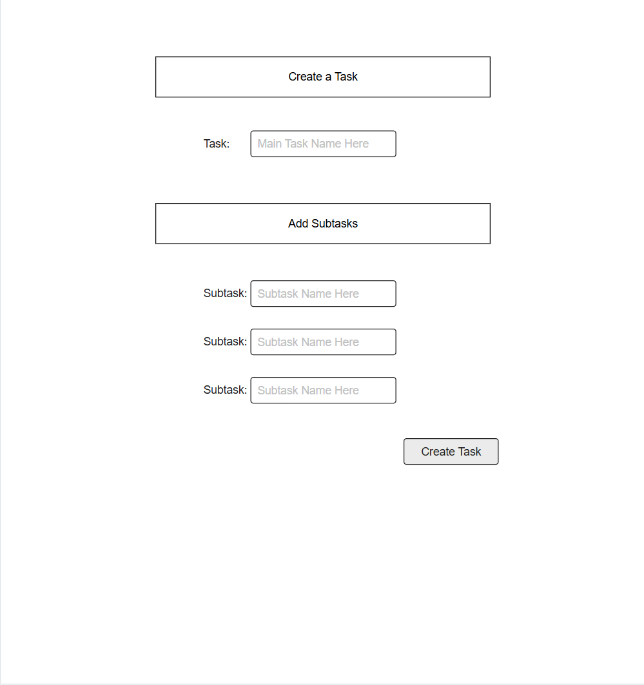
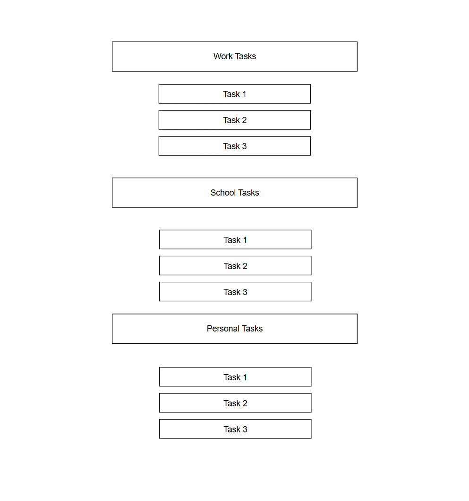

# Web Dev Starter Code

## Project Spec

### Theme
The general theme of my project will be that of a TODO app. While that theme is something that most people have experience with, I've made it through my classes so far making a variety of different projects, but never a TODO app. So, I’ve decided that an app of this type would be a fun venture into building a full-stack web app. This will be a TODO app that would be for personal use, with the usual functions, but I hope to add some other fun features along the way.

### What will it do?
This app will simply allow the user to place new tasks that need to be done within it, store those tasks, mark them as done, and multiple other features based on this core concept. Some of those other features will likely be the following.

-	Task categorization (Work, School, Personal, etc)
-	Task prioritization 
-	Some form of progress tracking? (potentially)
-	Subtasks
-	Comments on tasks
-	Some form of gamification? (potentially)

This app will integrate AWS as expected and will use those CRUD operations to store data within a database table. There will be a functioning JS backend and a HTML/CSS front-end. The goal will be to create a simple, accessible, but fun and useful TODO app. More customization of features is possible, but I want to start with the basics and not overreach for now. The goal will be to have 4 functional pages as expected, one will manage the task input, another will likely manage the storage and organization of tasks, some form of an about page or explanation page will likely be a piece, and finally a page for either commenting or customization of some form.

I would like the user to be able to input tasks, categorize and prioritize them, and have some ability to comment on those tasks or leave notes. The subtasks will serve as a way for the user to break a large task into a smaller set of tasks, which will help them to better plan for larger tasks. The UI will be simple and intuitive, as I want the app to be very accessible and easy to use. I want to build a TODO app where nearly any user could be handed the app and intuitively navigate their way through the app without instruction. It is possible that some functions will require a small pop-up for guidance, but I will figure those out as I build the app. 

Progress tracking and gamification are potential end goals of this app, but I must be realistic about time input as this is a solo full-stack web app, so we will see how realistic those goals are. 

### TARGET AUDIENCE
The target audience of this app will be the general public. The goal here is to create a TODO app that anyone could use for their personal planning and to keep track of tasks that they want to complete throughout the day. 

### Data
This app will manage text data from the user that will be stored in a table. This will be user-form input as they will be able to name the tasks and subtasks, comments on their tasks, and so on. The app will also deal with data involving holding the names of the categories and other prioritization functions of the app. Overall, this shouldn’t be much more than holding comments and tasks in a table, but some complexity may arise with prioritization and categorization.

### STRETCH GOALS
As listed above, there are a few different custom functionality pieces that I would like to add, but I won’t be completely sure if that is possible until I get a bit further into the construction of the app. I would like to have some gamification elements to the app if I have the time to implement them. This would be in the form of progress tracking and potentially some kind of medal system. Tracking stats for total number of completed tasks could be a fun concept. It would be cool to have some form of a login system as well, but that will be a further stretch goal to work towards if I have the time. 
Another possible section to add to the app would be giving the user the ability to have different themes or fonts, but I don’t think that is realistic within the given timespan, though maybe down the road I will implement that kind of functionality. 

## Project Wireframe
Below is a basic wireframe which entails what the primary two pages of the app will roughly look like.

